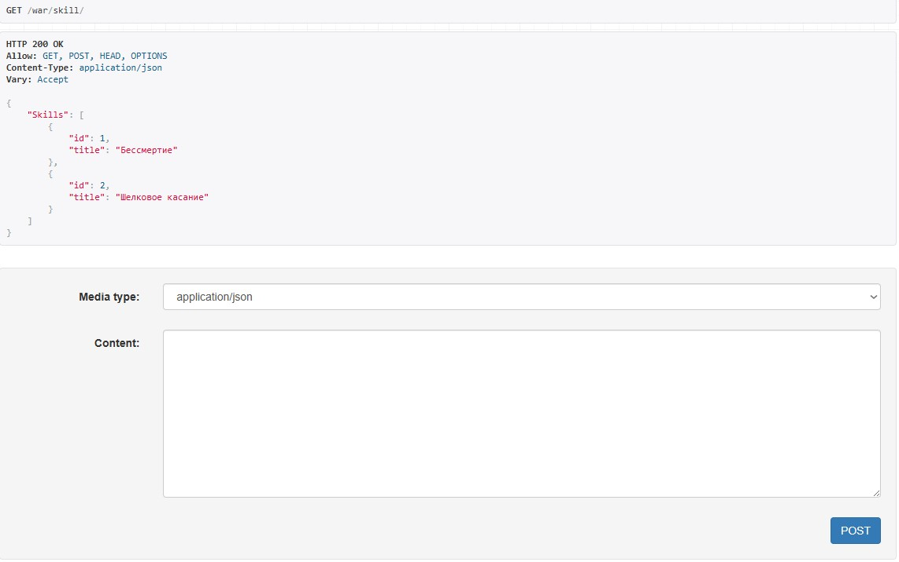
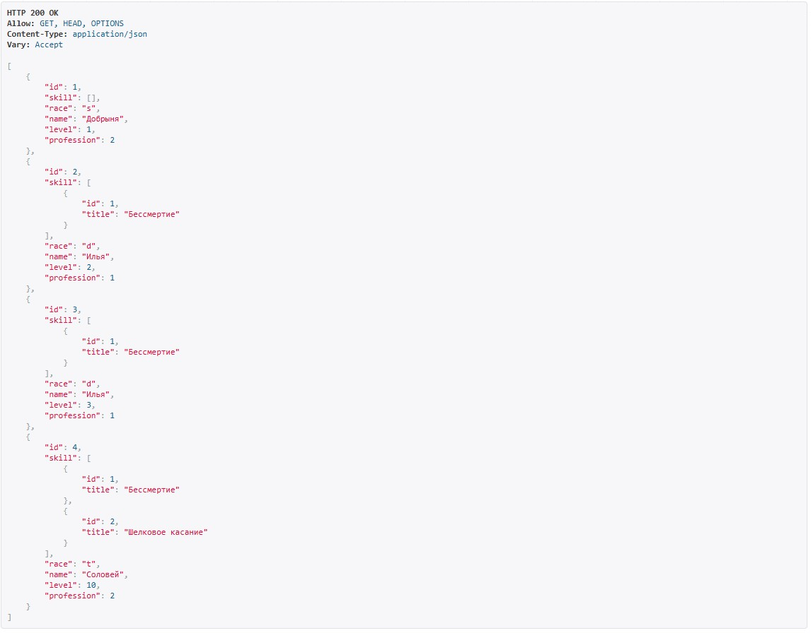
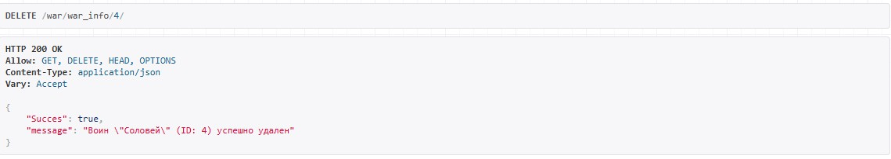
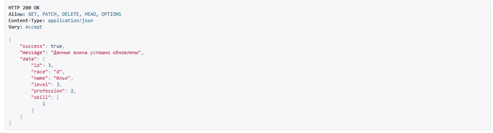

# Отчет по практической работе 3.2
Выполнил Скобликов Кирилл, K3339

## Задание 1
Реализовать ендпоинты для добавления и просмотра скилов методом, описанным в пункте выше.
```python
class SkillAPIView(APIView):
    def get(self, request):
        skills = Skill.objects.all()
        serializer = SkillSerializer(skills, many=True)
        return Response({"Skills": serializer.data})

    def post(self, request):
        skill = request.data
        serializer = SkillSerializer(data=skill)

        if serializer.is_valid(raise_exception=True):
            skill_saved = serializer.save()

        return Response({"Succes": "Skill '{}' created succesfully.".format(skill_saved.title)})
```


## Задание 2
Реализовать ендпоинты:
Вывод полной информации о всех войнах и их профессиях (в одном запросе).

views.py
```python
class WarriorProfessions(APIView):
    def get(self, request):
        warrior = Warrior.objects.select_related('profession').all()
        serializer = WarriorDetailSerializer(warrior, many=True)
        return Response(serializer.data)
```
serializers.py
```python
class WarriorDetailSerializer(serializers.ModelSerializer):
    profession = ProfessionSerializer(read_only=True)

    class Meta:
        model = Warrior
        fields = "__all__"
```

Вывод полной информации о всех войнах и их скилах (в одном запросе).
views.py
```python
class WarriorSkills(APIView):
    def get(self, request):
        warrior = Warrior.objects.prefetch_related('skill').all()
        serializer = WarriorDetailSkillsSerializer(warrior, many=True)
        return Response(serializer.data)
```
serializers.py
```python
class WarriorDetailSkillsSerializer(serializers.ModelSerializer):
    skill = SkillSerializer(many=True, read_only=True)

    class Meta:
        model = Warrior
        fields = "__all__"
```


Вывод полной информации о войне (по id), его профессиях и скилах.

Удаление война по id.

Редактирование информации о войне.

views.py
```python
class WarriorPK(APIView):
    def get(self, request, pk):
        warrior = Warrior.objects.filter(id=pk).first()
        serializer = WarriorFullSerializer(warrior)
        return Response(serializer.data)

    def delete(self, request, pk):
        warrior = Warrior.objects.filter(id=pk).first()
        if not warrior:
            return Response({"success": False, "error": f"Воин с ID {pk} не найден"})

        warrior_data = {'id': warrior.id, 'name': warrior.name}
        warrior.delete()
        return Response({"Succes": True, "message": f'Воин "{warrior_data["name"]}" (ID: {warrior_data["id"]}) успешно удален'})

    def patch(self, request, pk):
        warrior = Warrior.objects.filter(id=pk).first()
        if not warrior:
            return Response({"success": False, "error": f"Воин с ID {pk} не найден"})

        serializer = WarriorSerializer(warrior, data=request.data, partial=True)
        if serializer.is_valid():
            serializer.save()
            return Response({"success": True, "message": "Данные воина успешно обновлены", "data": serializer.data})
```
serializers.py
```python
class WarriorFullSerializer(serializers.ModelSerializer):
    profession = ProfessionSerializer(read_only=True)
    skill = SkillSerializer(many=True, read_only=True)

    class Meta:
        model = Warrior
        fields = "__all__"
```




