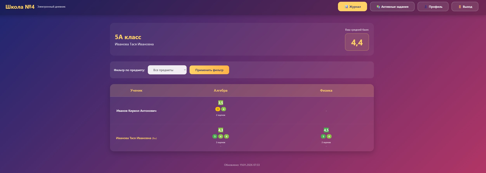

# Отчет по лабораторной работе №2
Выполнил Скобликов Кирилл, K3339

**Вариант 2:** Доска домашних заданий
О домашнем задании должна храниться следующая информация: предмет, преподаватель, дата выдачи, период выполнения, текст задания, информация о штрафах.

Необходимо реализовать следующий функционал:
- Регистрация новых пользователей.
- Просмотр домашних заданий по всем дисциплинам (сроки выполнения,
описание задания).
- Сдача домашних заданий в текстовом виде.
- Администратор (учитель) должен иметь возможность поставить оценку за
задание средствами Django-admin.
- В клиентской части должна формироваться таблица, отображающая оценки
всех учеников класса.

## Выполнение работы:
Начальная страница предлагает зарегистрироваться или авторизоваться:

На странице регистрации нужно ввести никнейм, почту, ФИО и выбрать, в зависимости от выбора ввести дополнительные данные

На странице авторизации нужно ввести никнейм и пароль, можно перейти на окно регистриции или в админ панель

После авторизации ученика идет редирект на страницу с таблией оценок

На странице с активными заданиями показываются все задания, есть сортировка по статусу сдачи и предмету

В профиле отображается информация об ученике, указанная при регистрации
