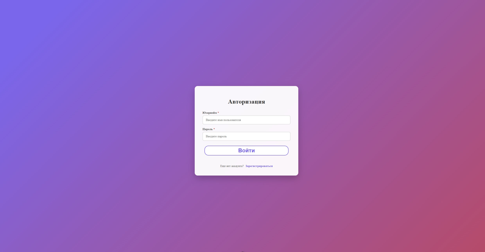
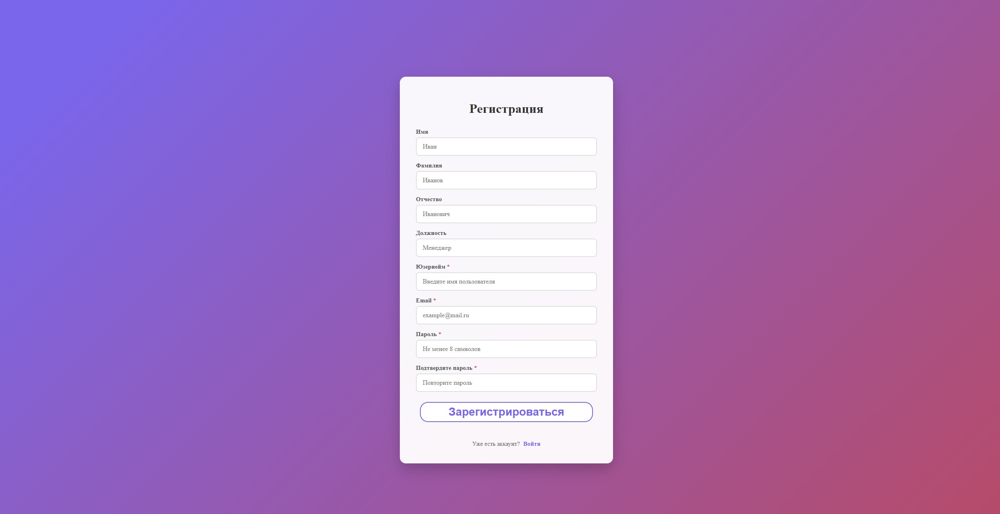
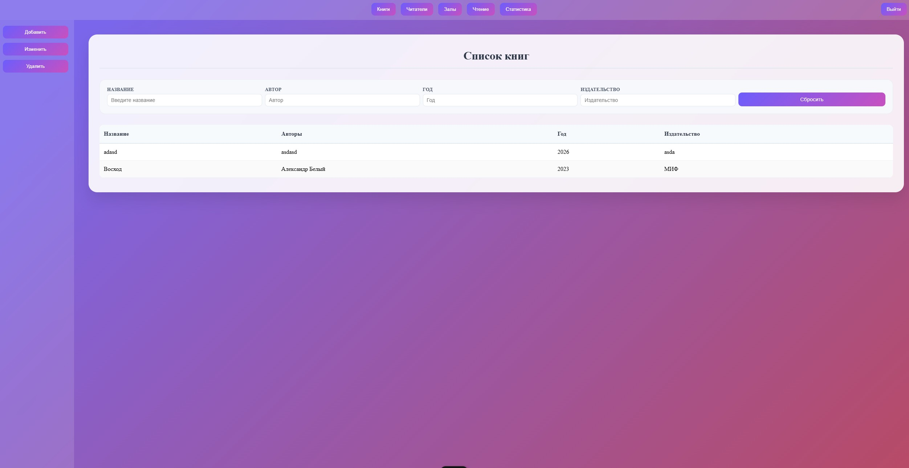
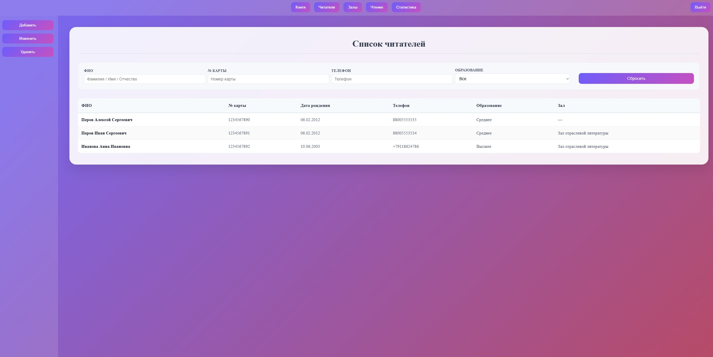

# Отчет по лабораторной работе №4
Выполнил Скобликов Кирилл, K3339

# 1. Описание варианта:
Реализована клиентская часть системы управления гостиницей на Vue.js 3. 
Приложение взаимодействует с REST API бэкенда на Django REST Framework, реализованного в лабораторной работе №3.

# 2. Структура проекта:
```text
library_front/
├── src/
│   ├── api/           # API клиент
│   ├── components/    # Компоненты страниц
│   ├── router/        # Маршрутизация
│   ├── pages/         # Страницы
│   ├── App.vue        # Корневой компонент
│   └── main.js        # Точка входа
├── public/            # Статические файлы
└── package.json       # Зависимости
```

# 3. Основные возможности:

## Регистрация и авторизация:

Пользователь вводит логин и пароль, после отправляется запрос к api:
```text
POST /auth/token/login/
```
Полученный токен записывается в localStorage, что позволяет хранить сессию между перезагрузками страницы.



## Интерфейс "Книги":
Страница /app/books/ отображает таблицу книг:
 - Название
 - Авторы
 - Год издания
 - Издательство

Также можно добавить новую книгу или удалить/изменить старую, или задать фильтр книгам:


## Интерфейс "Читатели":
Страница /app/readers/ отображает таблицу читателей:
 - ФИО
 - Номер билета
 - Дата рождения
 - Телефон
 - Образование
 - Зал

Также можно добавить нового читателя или удалить/изменить информацию о старом, или задать фильтр читателям:


## Интерфейс "Залы":
Страница /app/halls/ отображает таблицу залов:
 - Номер зала
 - Название
 - Вместимость

Также можно добавить новый зал или удалить/изменить старый, или задать фильтр залам:


## Интерфейс "Чтение":
Страница /app/reading/ отображает таблицу чтений:
 - Книга
 - Авторы
 - Читатель
 - Дата выдачи
 - Дата возврата

Также можно добавить новое чтение или удалить/изменить старое, или задать фильтр чтениям:


## Интерфейс "Статистика":
Страница /app/stats/ отображает таблицу разную статистику:
 - Распрделение читателей по уровню образования
 - Количество читателей младше 20 лет
 - Читатели, которые не вернули книгу в срок
 - Читатели редких книг
 - Книги на руках у конкретного читателя
 - Месячный отчет


## Вывод

В ходе разработки была создана современная, функциональная frontend-часть системы управления библиотекой. 
Реализован удобный и визуально цельный интерфейс, интегрированный с  backend-частью на Django REST Framework.

